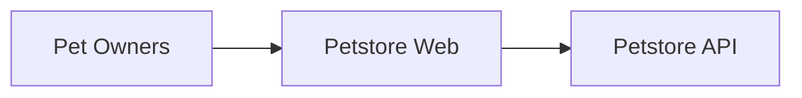

# Documentation repo example

## Petstore

- [Petstore API](./petstore/)

## Dependencies

- [redoc](https://github.com/Redocly/redoc#tldr-final-code-example)
- [core-docs](https://static.nrk.no/core-docs/latest/index.html)
- [mermaid-js](https://mermaid-js.github.io/mermaid/#/)
